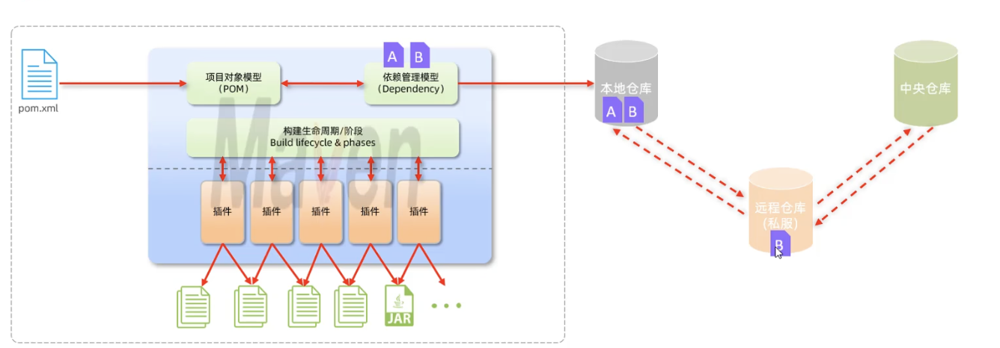
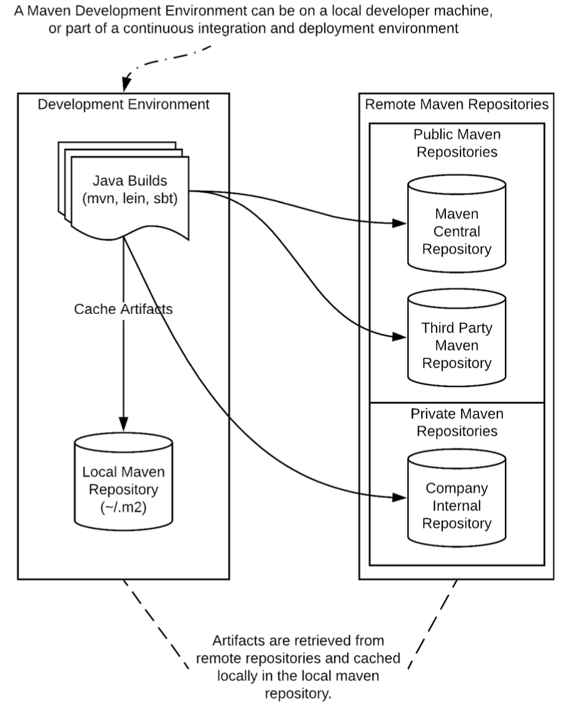

## Maven



#### Roles:

- Manage Dependencies
- Build Project Cycle
- Documentation
- Reporting
- Others

#### 

```ascii
a-maven-project
├── src
│   ├── main
│   │   ├── java
│   │   └── resources
│   └── test
│       ├── java
│       └── resources
├── target
└── pom.xml
```

项目的根目录`a-maven-project`是项目名，它有一个项目描述文件`pom.xml`，存放Java源码的目录是`src/main/java`，存放资源文件的目录是`src/main/resources`，存放测试源码的目录是`src/test/java`，存放测试资源的目录是`src/test/resources`，最后，所有编译、打包生成的文件都放在`target`目录里。

#### 1. Maven POM 常用标签

``` xml
<project xmlns = "http://maven.apache.org/POM/4.0.0"
    xmlns:xsi = "http://www.w3.org/2001/XMLSchema-instance"
    xsi:schemaLocation = "http://maven.apache.org/POM/4.0.0
    http://maven.apache.org/xsd/maven-4.0.0.xsd">
  
  	<!--父项目的坐标。如果项目中没有规定某个元素的值，那么父项目中的对应值即为项目的默认值。 坐标包括group ID，artifact ID和version。 -->
    <parent>
        <!--被继承的父项目的构件标识符 -->
        <artifactId />
        <!--被继承的父项目的全球唯一标识符 -->
        <groupId />
        <!--被继承的父项目的版本 -->
        <version />
        <!-- 父项目的pom.xml文件的相对路径。相对路径允许你选择一个不同的路径。默认值是../pom.xml。Maven首先在构建当前项目的地方寻找父项目的pom，其次在文件系统的这个位置（relativePath位置），然后在本地仓库，最后在远程仓库寻找父项目的pom。 -->
        <relativePath />
    </parent>
 
    <!-- 模型版本 -->
    <modelVersion>4.0.0</modelVersion>
    <!-- 公司或者组织的唯一标志，并且配置时生成的路径也是由此生成， 如com.companyname.project-group，maven会将该项目打成的jar包放本地路径：/com/companyname/project-group -->
    <groupId>com.companyname.project-group</groupId>
    <!-- 项目的唯一ID，一个groupId下面可能多个项目，就是靠artifactId来区分的 -->
    <artifactId>project</artifactId>
    <!-- 版本号 -->
    <version>1.0</version>
  	<!-- 本项目打包后文件所在的的目录是: /com/companyname/project-group/project/1.0/ -->
  	
  	<!-- 在 Maven 项目中用于定义一个多模块项目的子模块列表。父 POM 文件通过 <modules> 标签列出所有子模块，并为子模块提供共享的配置和依赖。 没有在父 POM 中声明 <modules> 标签时，子模块仍然可以通过 parent 标签继承父模块的配置。但这种方式需要您单独构建每个子模块，而不能通过一次构建父项目（`mvn clean install`）来构建所有子模块。使用 <modules> 标签可以简化多模块项目的构建和管理，因此在大多数情况下，建议在父 POM 中明确声明所有子模块。示例结构:
my-multi-module-project/
├── pom.xml        # 父 POM
├── module1/
|   └── pom.xml    # 子模块 1 的 POM
└── module2/
    └── pom.xml    # 子模块 2 的 POM -->
  	<modules>
        <module>module1</module>
        <module>module2</module>
    </modules>
  	
  	<!-- 统一管理项目的属性，引用时使用 ${mysql-connector.version} -->
  	<properties>
        <project.build.sourceEncoding>UTF-8</project.build.sourceEncoding>
        <project.reporting.outputEncoding>UTF-8</project.reporting.outputEncoding>
        <java.version>1.17</java.version>
        <mysql-connector.version>8.0.22</mysql-connector.version>
  	</properties>
  
  
   	<!--该元素描述了项目相关的所有依赖。 这些依赖组成了项目构建过程中的一个个环节。它们自动从项目定义的仓库中下载。 -->
    <dependencies>
        <dependency>
            <!-- 依赖的group ID -->
            <groupId>org.apache.maven</groupId>
            <!-- 依赖的artifact ID -->
            <artifactId>maven-artifact</artifactId>
            <!-- 依赖的版本号 -->
            <version>3.8.1</version>
            <!-- 依赖类型，默认类型是jar。它通常表示依赖的文件的扩展名。 -->
            <type>jar</type>
            <!-- 依赖的分类器。分类器可以区分属于同一个POM，但不同构建方式的构件。分类器名被附加到文件名的版本号后面。Maven 会默认下载和使用 example-library-1.0.0.jar 文件，这个 JAR 文件包含了编译后的字节码（通常是 .class 文件）。
通过使用 <classifier> 标签，可以引用其他类型的构件，而不仅仅是默认的字节码 JAR 文件。
例如：
- 源代码 JAR 文件：通常用于调试或开发目的，包含 .java 源代码文件: example-library-1.0.0-source.jar
- Javadoc JAR 文件：包含 JavaDoc 文档，方便开发者查看 API 文档: example-library-1.0.0-javadoc.jar
- 平台特定的 JAR 文件：用于特定操作系统或平台的构建变体: example-library-1.0.0-windows.jar -->
            <classifier></classifier>
            <!--依赖范围。在项目发布过程中，帮助决定哪些构件被包括进来。
- compile ：默认作用域。编译、测试和运行时都可用，且会被包含在打包文件中。
- provided：它表示依赖在编译和测试阶段可用，但在运行时不包含在应用程序的打包文件中。
- runtime: 用于声明那些在运行时需要，但在编译时不需要的依赖。example: 数据库驱动通常在编译时不需要，但在运行时需要。
- test: 用于test任务时使用。
- system: 类似于 provided，但需要显式指定依赖的路径，并且不会从远程仓库下载。
- systemPath: 仅用于范围为system。提供相应的路径。
- optional: 当项目自身被依赖时，标注依赖是否传递。用于连续依赖时使用 -->
            <scope>test</scope>
            <!--当计算传递依赖时，从依赖构件列表里，列出被排除的依赖构件集。即告诉maven你只依赖指定的项目，不依赖项目的依赖。此元素主要用于解决版本冲突问题 -->
            <exclusions>
                <exclusion>
                    <artifactId>spring-core</artifactId>
                    <groupId>org.springframework</groupId>
                </exclusion>
            </exclusions>
            <!--可选依赖，如果你在项目B中把C依赖声明为可选，你就需要在依赖于B的项目（例如项目A）中显式的引用对C的依赖。可选依赖阻断依赖的传递性。 -->
            <optional>true</optional>
        </dependency>
    </dependencies>
  
      <!-- 继承自该项目的所有子项目的默认依赖信息。这部分的依赖信息不会被立即解析,而是当子项目声明一个依赖（必须描述group ID和 artifact ID信息），如果group ID和artifact ID以外的一些信息没有描述，则通过group ID和artifact ID 匹配到这里的依赖，并使用这里的依赖信息。 
- 如果没有父pom里没有使用<dependencyManagement>声明，子模块必须自己指定所有依赖的版本。如果子模块间共享相同的依赖，但未使用 <dependencyManagement>，每个子模块都需要重复定义版本号，这可能导致版本不一致和管理困难。-->
    <dependencyManagement>
        <dependencies>
            <dependency>
                ......
            </dependency>
        </dependencies>
    </dependencyManagement>
  
</project>
```

#### 2. Maven plugins

Maven 插件则是用于在构建过程中执行特定任务的工具。这些任务包括编译代码、运行测试、打包成 JAR 文件、部署应用等。插件的执行通常是在 Maven 的生命周期阶段中进行的，而不是在代码中直接调用。

在maven或者第三方提供的插件中，默认配置（参数，执行的生命周期，绑定目标等）都已经满足绝大多数需求。在我们使用时可以直接通过maven坐标引用即可，或者根据需要重写相关配置。在自定义插件中我们需要手动配置：

示例

```xml
<build>
    <plugins>
        <plugin>
            <!-- 插件的组 ID -->
            <groupId>org.apache.maven.plugins</groupId>
            <!-- 插件的标识符 -->
            <artifactId>maven-compiler-plugin</artifactId>
            <!-- 插件的版本 -->
            <version>3.8.1</version>
            
            <!-- 插件的配置参数 -->
            <configuration>
                <source>1.8</source>
                <target>1.8</target>
            </configuration>
            
            <!-- 插件的执行配置 -->
            <executions>
                <execution>
                    <!-- 执行的 ID，可以任意命名，它的主要作用是为该执行配置提供一个唯一的标识符，便于引用和管理。虽然这个 ID 并不是必须的，但在某些情况下，它非常有用。-->
                    <id>default-compile</id>
                    <!-- 绑定到的生命周期阶段 -->
                    <phase>compile</phase>
                    <!-- 要执行的目标 -->
                    <goals>
                        <goal>compile</goal>
                    </goals>
                    <!-- 针对该执行的具体配置 -->
                    <configuration>
                        <!-- 可覆盖全局配置 -->
                    </configuration>
                </execution>
            </executions>
            
            <!-- 插件的依赖项 -->
            <dependencies>
                <dependency>
                    <groupId>some.group</groupId>
                    <artifactId>some-artifact</artifactId>
                    <version>1.0.0</version>
                </dependency>
            </dependencies>
        </plugin>
    </plugins>
</build>

<!-- 为了简化多个模块项目中的插件版本管理，可以使用 pluginManagement 元素在父 POM 中集中管理插件版本：-->
<pluginManagement>
    <plugins>
        <plugin>
					...
      	</plugin>
      	...
    </plugins>
</pluginManagement>

```

#### 3. Maven Life Cycle

##### Clean life cycle

- **clean**：Removes the `target` directory generated by the build process, deletes temporary files and prepares for a fresh build.

##### Default(Build) life cycle

| Phase                    | plugin:goal for the `jar` packaging | Description                                                  |
| :----------------------- | :---------------------------------- | :----------------------------------------------------------- |
| `process-resources`      | `resources:resources`               | This phase is responsible for copying and filtering the resources of the main source code to the target directory. |
| `compile`                | `compiler:compile`                  | In this phase, the main source code is compiled to bytecode using the Java compiler. |
| `process-test-resources` | `resources:testResources`           | Similar to `process-resources`, but for test resources. It copies and filters test resources to the target directory. |
| `test-compile`           | `compiler:testCompile`              | This phase compiles the test source code to bytecode. It ensures that the test code is ready to be executed. |
| `test`                   | `surefire:test`                     | This phase runs the compiled test code using a testing framework (like JUnit) and reports the results. |
| `package`                | `jar:jar`                           | During this phase, the compiled code and resources are packaged into a JAR file, ready for distribution. |
| `install`                | `install:install`                   | This phase installs the packaged JAR file into the local Maven repository, making it available for other projects on the local machine. |

- **process-resources**: This phase handles the preparation of resource files for the main source code. Resources are non-code files (e.g., properties files, configuration files) that are needed during runtime. This goal copies these files to the target directory, optionally performing filtering (e.g., replacing placeholders with actual values).

- **compile**: This phase compiles the main source code into bytecode that can be executed on the Java Virtual Machine (JVM). It processes the `.java` files located in the `src/main/java` directory and outputs `.class` files into the `target/classes` directory.

- **process-test-resources**: This phase is similar to `process-resources`, but it deals with test resources. These are non-code files required for testing purposes. The goal copies these files from `src/test/resources` to the target test directory, optionally performing filtering.

- **test-compile**: This phase compiles the test source code. It processes the `.java` files located in the `src/test/java` directory and outputs `.class` files into the `target/test-classes` directory. This ensures that the test classes are ready to be executed in the `test` phase.

- **test**: This phase runs the compiled test code using a specified testing framework, typically JUnit or TestNG. The results of these tests (pass, fail, errors) are reported, and detailed test reports are generated. This is essential for verifying that the code works as expected.

- **package**: During this phase, the compiled classes and resources are packaged into a JAR (Java Archive) file. This JAR file is a compressed file format that includes all necessary files to run the application. The resulting artifact is typically found in the `target` directory.

- **install**: This phase installs the packaged JAR file into the local Maven repository (usually located at `~/.m2/repository`). This makes the artifact available for use as a dependency in other projects on the same machine. It is an essential step for reusing the built artifact locally.

##### Site life cycle

- **site**: generates project documentation for your Maven project. This documentation is typically created from the project's POM file and other sources like Javadoc, reports from testing frameworks, and other plugins.
- **deploy-site**: is used to generate the site documentation and then deploy it to a remote server. This is typically used for sharing the generated project documentation with others, for example, by publishing it on a web server or a documentation hosting service.

##### Notes

- 在一个生命周期中，运行某个阶段的时候，它之前的所有阶段都会被运行，只有test阶段可以跳过: `mvn clean install -Dmaven.test.skip=true`。
  - 为什么需要设置-Dmaven.test.skip = true: 加快构建时间/测试已经单独执行/紧急情况需要快速构建部署。

#### 4. Maven Repository



- 配置远程仓库

  ```xml
  <project>
    ...
    <repositories>
      <repository>
        <id>company-repo</id>
        <url>http://repository.mycompany.com/maven2</url>
      </repository>
      <repository>
        <id>third-party-repo</id>
        <url>http://repository.thirdparty.com/maven2</url>
      </repository>
    </repositories>
    ...
  </project>
  ```

- 配置仓库镜像(mirror)

  ```xml
  <settings>
    ...
    <mirrors>
      <mirror>
        <id>central-mirror</id>
        <mirrorOf>central</mirrorOf>
        <url>http://mirror.mycompany.com/central</url>
      </mirror>
      <mirror>
        <id>all-repos-mirror</id>
        <mirrorOf>*</mirrorOf>
        <url>http://mirror.mycompany.com/maven2</url>
      </mirror>
    </mirrors>
    ...
  </settings>
  ```

  

## Git & Github


#### Git commands

[Git Practice](https://learngitbranching.js.org)

##### Create a repository

```shell
git init 		# initialize a repository
git clone 	# download a copy from remote repository
```

##### Commit and update

###### `git add`

添加文件到暂存区

```shell
git add [file1] [file2] ...  	# add multiple files(current folder) to staging area
git add [dir]  								# add a directory to staging area
git add . 
```

###### `git status`

可以查看在你上次提交之后是否有对文件进行再次修改

```shell
git status
git status -s 	# 获得简短版本输出结果
# output: 
# AM README
# A  hello.php
```

- A: Already added to staging area
- M: modified
- AM: modified after adding to staging area

###### `git diff`

```shell
git diff [file] 													# 显示该文件在workspace 和 staging area中的差异
git diff --cached [file] 									# 显示该文件在staging area和上一次commit的差异
git diff --staged [file] 									# 同上
git diff [first-branch]...[second-branch] # 显示两次提交之间的差异
```

```output
# output
diff --git a/README.md b/README.md
index c9bfbe9..2c2422f 100644
--- a/README.md
+++ b/README.md
@@ -1,4 +1,4 @@
 initial readme
 change in test branch
-change 01
 change 02
+change 03
```

- `diff --git a/README.md b/README.md`: `README.md`文件有一处不同，a表示旧的版本，b表示新版本

- `index c9bfbe9..2c2422f 100644`: `c9bfbe9..2c2422f`是两个版本文件的SHA1哈希码，`100644`是`file mode`.

- `--- a/README.md`, `+++ b/README.md`声明，在下面的差异显示中`-`代表a版本，`+`代表b版本

- `@@ -1,4 +1,4 @@`:

  - `@@ -<start line>,<number of lines> +<start line>,<number of lines> @@`
  - `<start line>,<number of lines>`指明文件(a/REAMDME.md)中差异发生的位置
  - `-`表示旧文件, `+`表示更改后的文件

-  ```
   initial readme
   change in test branch
  -change 01
   change 02
  +change 03
  ```

  - 不带符号的表示没有差异的内容
  - `-`表示在只旧文件中存在的内容（即删除的内容）
  - `+`表示只在新文件中存在的内容（即添加的内容）

###### `git commit`

用于提交staging area的文件到仓库

```shell
git commit -m [message] 										# 提交暂存区所有内容，并添加备注信息
git commit [file1] [file2] ... -m [message] # 提交暂存区的制定文件，并添加备注信息
git commit -a 															# -a 参数设置修改文件后不需要执行 git add 命令，直接从工作区提交
git commit -am [message] 										# 跳过 git add直接提交并添加备注信息
```

###### `git reset`

用于回退版本，可以指定退回某一次提交的版本。

```shell
git reset [--soft | --mixed | --hard] [HEAD] [file1] [file2] ... # 基本语法格式

# --mixed 为默认，可以不用带该参数，用于重置暂存区的文件与上一次的提交(commit)保持一致，并改变HEAD指针的位置，工作区文件内容保持不变。
git reset
git reset HEAD^            # 回退所有暂存区内容到上一个版本，HEAD指针指向上一个版本  
git reset HEAD^ hello.php  # 回退 hello.php 文件的版本到上一个版本
git reset 052e           	 # 回退到指定版本

# --soft 参数用于把回退到某个版本，保留工作区和暂存区的内容，只更改HEAD的指针
git reset --soft HEAD~3 

# --hard 参数撤销工作区中所有未提交的修改内容，将暂存区与工作区都回到上一次版本，并删除之前的所有信息提交：
# Be careful using --hard!!!
git reset --hard HEAD
```

**HEAD 说明：**

- `HEAD` 表示当前版本
- `HEAD^` 上一个版本
- `HEAD^^` 上上一个版本
- 以此类推...

可以使用 ～数字表示

- `HEAD~0`表示当前版本
- `HEAD~1` 上一个版本
- `HEAD^2` 上上一个版本
- 以此类推...

###### `git rm`

git rm 命令用于删除文件。

如果只是简单地从工作目录中手工删除文件，运行 `git status` 时就会在 `Changes not staged for commit` 的提示。

```shell
git rm runoob.txt 						# 将文件从暂存区和工作区中删除
git rm -f runoob.txt 					# 如果删除之前修改过并且已经放到暂存区域的话，则必须要用强制删除选项 -f
git rm --cached runoob.txt		# 把文件从暂存区域移除，但仍然希望保留在当前工作目录中(相当于撤销git add)
git rm –r * 									# 递归删除（目录）
```


###### `git checkout`

用于分支切换

```shell
git checkout main 									# 切换到主分支
git checkout -b <new-branch-name> 	# 创建一个新分支 <new-branch-name> 并立即切换到新创建的分支
git checkout - 											# 快速切换回前一个分支，无需记住分支名称

git checkout -- <file> 							# 将指定文件 <file> 恢复到最新的提交状态，丢弃所有未提交的更改，撤销不需要的更改
git checkout tags/<tag-name> 				# 如果你有一个标签 <tag-name>，你可以使用这个命令来切换到该标签所指向的提交状态。
git branch 													# 列出可用的本地分支和标签，以便快速选择要切换的目标
```


###### `git switch`

同样用于分支切换

```shell
git switch <branch-name>
git switch -c <new-branch-name>
git switch -
```

与 git checkout 不同，git switch 更容易理解和使用，因为它专注于分支切换的操作，此外，git switch 还提供了更好的错误检查，可以避免一些常见的错误操作


###### `git restore`

用于恢复或撤销文件的更改。包括还原文件到最新提交的状态、丢弃未暂存的更改、丢弃已暂存但未提交的更改等。

```shell
git restore <file> # 如果staging area为空，将workspace指定文件 <file> 恢复到最新的提交状态，丢弃所有未提交的更改。如	果staging area存在未提交的更改，该命令会将workspace中的<file>恢复到staging area的内容。
git restore --staged <file> # 已经使用 git add 将文件添加到暂存区，但希望撤销这些更改
git restore --source=<commit> <file> # 将文件 <file> 恢复到特定提交 <commit> 的状态，可以使用以下命令
```


##### Logging

###### `git log`

基本语法：`git log [选项] [分支名/提交哈希]`

常用的选项包括：(建议动手尝试不同选项)

- `-p`：显示提交的补丁（具体更改内容）。
- `--oneline`：以简洁的一行格式显示提交信息。
- `--graph`：以图形化方式显示分支和合并历史。
- `--decorate`：显示分支和标签指向的提交。
- `--author=<作者>`：只显示特定作者的提交。
- `--since=<时间>`：只显示指定时间之后的提交。
- `--until=<时间>`：只显示指定时间之前的提交。
- `--grep=<模式>`：只显示包含指定模式的提交消息。
- `--no-merges`：不显示合并提交。
- `--stat`：显示简略统计信息，包括修改的文件和行数。
- `--abbrev-commit`：使用短提交哈希值。
- `--pretty=<格式>`：使用自定义的提交信息显示格式


###### `git blame`

用于逐行显示指定文件的每一行代码是由谁在什么时候引入或修改的，基本语法：`git blame [选项] <文件路径>`

常用的选项包括：

- `-L <起始行号>,<结束行号>`：只显示指定行号范围内的代码注释。
- `-C`：对于重命名或拷贝的代码行，也进行代码行溯源。
- `-M`：对于移动的代码行，也进行代码行溯源。
- `-C -C` 或 `-M -M`：对于较多改动的代码行，进行更进一步的溯源。
- `--show-stats`：显示包含每个作者的行数统计信息。


##### Remote 

###### `git remote`

用于管理 Git 仓库中的远程仓库。

```shell
git remote 																	# 列出当前仓库中已配置的远程仓库。
git remote -v 															# 列出当前仓库中已配置的远程仓库，并显示它们的 URL。
git remote add <remote_name> <remote_url> 	# 添加一个新的远程仓库
git remote rename <old_name> <new_name> 		# 将已配置的远程仓库重命名
git remote remove <remote_name>  						# 从当前仓库中删除指定的远程仓库
git remote set-url <remote_name> <new_url> 	# 修改指定远程仓库的 URL
git remote show <remote_name> 							# 显示指定远程仓库的详细信息，包括 URL 和跟踪分支
```


###### `git pull`

`git pull` 其实就是 `git fetch` 和 `git merge FETCH_HEAD` 的简写

```shell
git pull <远程主机名> <远程分支名>:<本地分支名> # 如果远程分支是与当前分支合并，则冒号后面的部分可以省略。
```


###### `git push`

```shell
git push <远程主机名> <本地分支名>:<远程分支名> # 如果本地分支名与远程分支名相同，则可以省略冒号
```

