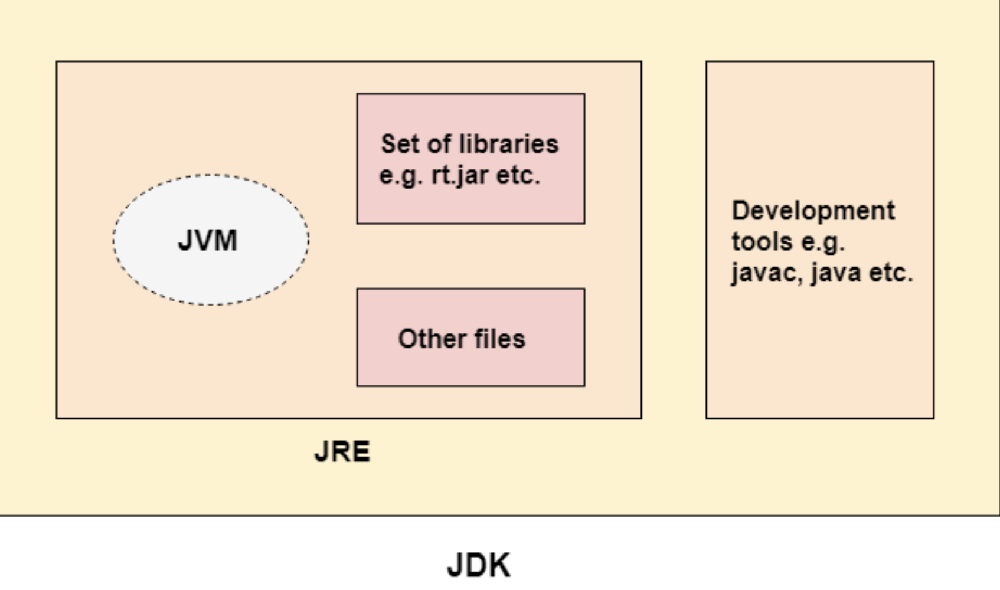

## Java Basic

##### JDK vs. JRE vs. JVM

- **JDK** contains a private **JRE** and a few other tools such as **an interpreter/loader (java), a compiler (javac), an archiver (jar), a documentation generator (Javadoc), etc**.

- **JRE** contains a **Java Virtual Machine (JVM)** and necessary class libraries to run applications written in Java. 

- **JVM** provides a runtime environment  in which java bytecode can be executed. It's **platform independent**. (JDK and JRE are platform-dependent)



##### Java data types

###### Primitive data types

| 基本类型 | 位数 | 字节 | 默认值  | 取值范围                                                     |
| -------- | ---- | ---- | ------- | ------------------------------------------------------------ |
| byte     | 8    | 1    | 0       | -128 ~ 127                                                   |
| short    | 16   | 2    | 0       | -32768 (-2^15) ~ 32767 (2^15 - 1)                            |
| int      | 32   | 4    | 0       | -2147483648 ~ 2147483647                                     |
| long     | 64   | 8    | 0L      | -9223372036854775808 (-2^63) ~ 9223372036854775807 (2^63 - 1) |
| char     | 16   | 2    | 'u0000' | 0 ~ 65535 (2^16 - 1)                                         |
| float    | 32   | 4    | 0f      | 1.4E-45 ~ 3.4028235E38                                       |
| double   | 64   | 8    | 0d      | 4.9E-324 ~ 1.7976931348623157E308                            |
| boolean  | 1    |      | false   | true, false                                                  |

- Storage Location:
  - Local variables: stored on the stack.
  - Instance variables (member variables): stored within the objects on the heap.

###### Reference Data Types

- Storage Location: 
  - The reference (address) itself is stored on the stack if it's a local variable or on the heap if it's a member variable.
  - The actual objects they point to are stored on the heap.


##### String Constant Pool

The String constant pool in Java is a special memory area used for storing string literals. It is part of the Java heap memory but is maintained separately by the JVM to optimize memory usage and improve performance, especially when it comes to handling string literals.

- When you create a string literal in Java, the JVM checks the String Constant Pool first. If it already exists, JVM will return the reference(address) to the string literal. If not, JVM will add it to the pool then return the reference.

- String interning: you can manually add a string to the String Constant Pool:

  ``` java
  String str1 = new String("Hello");
  String str2 = str1.intern();
  // str4 now refers to the string in the constant pool, while str3 refers to the newly created string object.
  ```

###### Questions

1. Why string is immutable

   - **Security**: Strings are often used to handle sensitive data, such as passwords, file paths, and network connections. Immutability ensures that the string cannot be altered by malicious code after it has been created.

   - **Thread Safety**: Immutable objects are inherently thread-safe, meaning they can be shared among multiple threads without synchronization. This simplifies concurrent programming and reduces the likelihood of bugs related to shared data.

   - **Hashcode Caching**: The immutability of strings allows their hash code to be cached at the time of creation. This makes the retrieval of the hash code faster, which is particularly beneficial for strings used as keys in hash-based collections like `HashMap`.

   - **String Pooling**: The String constant pool (or intern pool) is a special memory region where Java stores string literals. If strings were mutable, it would be unsafe to share them in the pool, as any change to one instance would affect all references. Immutability allows the JVM to safely reuse instances of string literals, saving memory and improving performance.


##### Final Keyword

- **Final Variable**

  ```java
  public static final String APP_NAME=“testApp”
  ```

  - **Purpose**: define **constants**

- **Final Method**

  ```java
  public final int add(int a, int b){ return a + b; }
  ```

  - **Purpose**: prevent override

- **Final Class** 

  ```java
  public final class MyClass{}
  ```

  - **Purpose**: 
    - prevent **inheritance**, for example: Integer, String;
    - make class immutable. (To do so all the fields in the class should be final)

###### Questions

1. difference between: final, finally, finalize

   - `final`: used with variables, methods or class

   - `finally`: Used in conjunction with try-catch blocks. Ensures that a block of code is always executed

   - `finallize`: Used with objects. A method called by the garbage collector before an object is garbage collected. It provides a mechanism for cleanup before the object is removed from memory. Now deprecated (after java 9)


##### Static Keyword

- Static variable and static block

  - Static variable: also known as class variables. Belongs to the class and there only one copy of static variables no matter how many instances of class there are.

  - Static block: Static blocks are used to initialize static variables. They are executed when the class is loaded into memory, before any instances of the class are created.

    ```java
    public class InitializationExample {
        public static int value;
    
        static {
            value = 42;
        }
    
        public static void main(String[] args) {
            System.out.println(InitializationExample.value);  // Outputs 42
        }
    }
    ```

    

- Static methods

  - Static methods belong to the class rather than to any particular object instance. They can be called without creating an instance of the class.

- Static class

  - A static nested class is a static class defined within another class. It can be instantiated without an instance of the outer class.

    ```java
    public class OuterClass {
        public static class StaticNestedClass {
            // class body
        }
    }
    ```

- Loading time

  - **Class Loading**: When a Java class is loaded by the classloader, its static variables and static initialization blocks are initialized. This happens the first time the class is referenced, whether it's through accessing a static member or creating an instance of the class.
  - **Timing**: This loading and initialization occur before any static methods, static variables, or static blocks are accessed or executed.

###### Questions

1. Can static method access non-static varibales?
   - No. static methods belongs to the class instead of instances.

2. Common Static Methods?
   - `Math.abs()`, `Math.min()`
   - `Collections.sort()`, `Collections.shuffle()`, `Collections.reverse()`
   - `Arrays.sort()`, `Arrays.copyOf()`

3. When to use static methods?
   - Tools or untils methods. (`Integer`, `String`, `Math`, `System`)


## OOP

##### Class and object

An **object** is an instance of a module, and a **class** is its definition/blueprint.

- Class Components

  - Fields/Properties 

  - Methods/Function 

  - Constructor

    - Default constructor

      ```java
      public Car() {}
      ```

    - Parameterized constructor

      ```java
      public Car(Sting brand, String carType, Wheel wheel){...}
      ```


##### Encapsulation, Inheritance and polymorphism 

- **Encapsulation** in OOP refers to bundling data and methods that work on that data within one unit, like a class in Java.
  - Java implement:
    - **Private Variables**: Declare the variables of a class as `private` to restrict direct access from outside the class.
    - **Public Methods**(Getter ans Setter): Provide `public` getter and setter methods to allow controlled access to the private variables. This way, you can validate the data before assigning it or returning it.

- **Inheritance** provides a way to create a new class from an existing class.
  - In Java, **Multiple** inheritance (one son many parents) are applicable using **interface**(implements) only
  - Advantages:
    - **Re-usability/Avoiding Duplication** of Code
    - **Extensibility**:add a new method to super class, then all sub-classes have this new method
- **Polymorphism**
  - **polymorphism** refers to the same object exhibiting different **forms and behaviors**.
  - **Static** Polymorphism - **Overload** (same class) - **compile time**
  - **Dynamic** Polymorphism - **Override** (child class) - **run time**

##### Overriding vs Overloading

 *Method overriding* is the process of redefining a parent class’s method in a subclass.

*Method overloading*: different number of arguments **OR** diff type of arguments **AND** same method name

| Method Overloading                                           | Method Overriding                                            |
| ------------------------------------------------------------ | ------------------------------------------------------------ |
| Overloading happens at **compile time**.                     | Overriding happens at **runtime**                            |
| Gives **better performance** because the binding is being done at compile time. | Gives **less performance** because the binding is being done at runtime. |
| **Private** and **final** methods can be **overloaded**.     | **Private** and **final** methods can **NOT** be overridden. |
| Return type of method does not matter in case of method overloading. | Return type of method must be the same in the case of overriding. |
| **Arguments must be different** in the case of overloading.  | **Arguments must be the same** in the case of overriding.    |
| It is being done in the **same class**.                      | Base and derived (**child**) classes are required here.      |
| Mostly used to increase the **readability** of the code.     | Mostly used to provide the **implementation** of the method that is already provided by its base class. |

###### Questions

1. Same arguments, same method name, diff return type. is it overloading? is it allowed in java?
   - No. (1)Diff number of arguments (2) Diff type of arguments: one of them must be satisfied.

2. what is **static** polymorphism? what is **dynamic** polymorphism.
   - static polymorphism = compile-time polymorphism = overloading
   - Dynamic polymorphism = runtime polymorphism =overriding


##### Abstract

- What is the relationship between OOP and abstract class/interface?

###### Abstract methods

- Abstract methods cannot be declared as **private** or in a non-abstract class.

- **No Method body** {...}
- can declared inside an **abstract class** and **interface**
  - **NON-abstract classes cannot have abstract methods**

- **can NOT** be declared **private**
  - it **has to** be implemented in child classes

###### Abstract Class

- An **abstract class** can have everything else as same as a normal Java class has **i.e**. constructor, static variables and methods .
- **Non-abstract/Normal methods** can be implemented in an **abstract class** (At least in Java 8)
- An abstract class **cannot** be **instantiated**

- Child classes **must implement all the abstract methods** declared in the parent abstract class.

###### Interface

- An **interface** can have: 
  - abstract method(s)
  - default method(s)
  - static method(s)
  - private method(s)
  - private static method(s) 
  - public static final variable(s): In interface they can only have variables that are public, static and final. (Constants)
  
- methods -> by default **public**
- varibles -> by default **public static final**

- **cannot** be **instantiated**

- An interface **cannot** be declared **private** or **protected**.

  - Top level abstract classes and interfaces can only be `public` or `default`(package private).

- **cannot** have **constructor(s)** in it

  - can abstract class have constructors?

  - Why abstract class have construtors? (cause non-static fields)